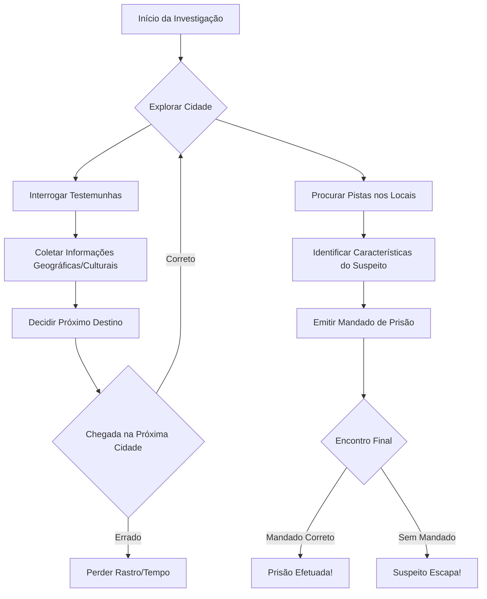

# 🕵️‍♀️ Where in the World is Carmen Sandiego?

[](LICENSE)
[](https://reactjs.org/)
[](https://www.typescriptlang.org/)
[](https://expressjs.com/)


## 🌎 Sobre o Jogo

Reviva a experiência clássica de investigação e aventura! Neste jogo, você assume o papel de um detetive da agência **ACME**, encarregado de rastrear a lendária ladra **Carmen Sandiego** e sua gangue ao redor do globo. Explore cidades, siga pistas, interrogues testemunhas e use seu intelecto para prender os criminosos antes que o tempo acabe.

---

## 🚀 Fluxo de Jogo (Gameplay Loop)

Abaixo, apresentamos como funciona a lógica principal de investigação:



---

## ✨ Funcionalidades

- **Viagem Global**: Viaje entre cidades icônicas seguindo o rastro da V.I.L.E.
- **Sistema de Pistas**: Utilize informações sobre geografia, cultura e história para identificar o próximo destino.
- **Dossiê de Suspeitos**: Colete descrições físicas e hobbies para filtrar os suspeitos e obter o mandado correto.
- **Interface Retro-Noir**: Design inspirado nos títulos clássicos da série, com animações de máquina de escrever e estética de terminal.
- **Banco de Dados**: Gerenciamento de progresso e informações de suspeitos via MongoDB.

---

## 🛠️ Stack Tecnológica

O projeto foi construído com ferramentas modernas para garantir performance e escalabilidade:

### Frontend
- **React 18** & **TypeScript**: Interface reativa e tipagem estrita para maior segurança.
- **Styled Components**: Componentização visual com CSS-in-JS.
- **React Router**: Navegação fluida entre telas de jogo, menus e login.

### Backend
- **Node.js** & **Express**: Servidor robusto para gerenciar a lógica do jogo e autenticação.
- **MongoDB** & **Mongoose**: Banco de dados NoSQL para persistência de dados de usuários e estado do jogo.

---

## 📦 Como Executar

### Pré-requisitos
- Node.js (v16+)
- MongoDB (rodando localmente ou via Atlas)

### Instalação

1. Clone o repositório:
   ```bash
   git clone git@github.com-pessoal:Kamifaria/Carmen-Sandiego-Game.git
   cd Carmen-Sandiego-Game
   ```

2. Instale as dependências:
   ```bash
   npm install
   ```

3. Configure o banco de dados:
   Certifique-se de que o MongoDB está ativo.

4. Inicie o projeto em modo de desenvolvimento:
   ```bash
   npm run dev
   ```
   *O comando acima utiliza `concurrently` para iniciar tanto o servidor Express quanto o app React simultaneamente.*

---

## 🤝 Contribuição

Contribuições são super bem-vindas! Sinta-se à vontade para abrir Issues ou enviar Pull Requests.

---

## 🛡️ Licença

Este projeto está sob a licença [MIT](LICENSE).

---

<p align="center">
  Feito com ❤️ por Kamila Faria
</p>
